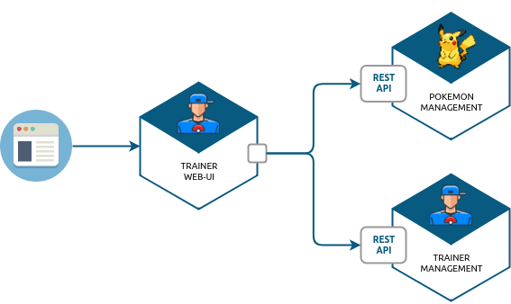
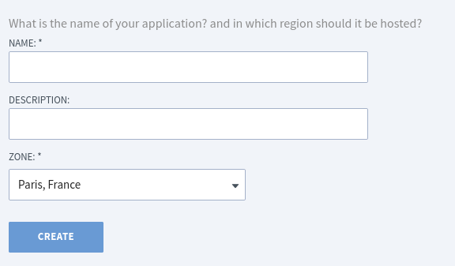

:source-highlighter: pygments
:prewrap!:

:icons: font

:toc: left
:toclevels: 4

:linkattrs:

:sectlinks:
:sectanchors:
:sectnums:

:experimental:

= ALOM - TP 5 - GUI - MVC & Templating

== Présentation et objectifs

Le but est de continuer le développement de notre architecture "à la microservice".

Nous allons aujourd'hui développer la WEB-UI de gestion des dresseurs de Pokemon.

Ce micro-service se connectera au micro service de pokemon management et trainer management!

[NOTE]
====
On ressemble de plus en plus à une architecture micro-service, comme celle d'UBER !
====

Nous allons développer :

1. deux repositories, qui accèdent aux données de trainer management et pokemon management
2. un service d'accès aux données
3. annoter ces composants avec les annotations de Spring et les tester
4. créer un controlleur spring pour gérer nos requêtes HTTP / REST
5. créer des templates pour afficher nos données

[TIP]
====
Nous repartons de zéro pour ce TP !
====

== Github

Identifiez vous sur Github, et cliquez sur le lien suivant pour créer votre repository git: https://classroom.github.com/a/AnTVotVt[Github classroom,window="_blank"]

Clonez ensuite votre repository git sur votre poste !

TIP: N'oubliez pas ! Vous n'avez pas besoin de forker ce repostiory pour travailler, il vous appartient !

== Le `pom.xml`

Modifiez le fichier pom.xml à la racine du projet

[source,xml,linenums]
----
<project>
    <modelVersion>4.0.0</modelVersion>
    <groupId>com.miage.alom</groupId>
    <artifactId>game-ui</artifactId> <!--1-->
    <version>0.1.0</version>
    <packaging>jar</packaging> <!--2-->

    <parent>
        <groupId>org.springframework.boot</groupId>
        <artifactId>spring-boot-starter-parent</artifactId>
        <version>2.5.5</version> <!--2-->
    </parent>

    <properties>
        <maven.compiler.source>17</maven.compiler.source> <!--3-->
        <maven.compiler.target>17</maven.compiler.target> <!--3-->
    </properties>

    <dependencies>

        <!-- spring-boot web-->
        <dependency>
            <groupId>org.springframework.boot</groupId> <!--2-->
            <artifactId>spring-boot-starter-web</artifactId>
        </dependency>

        <!-- testing --> <!--4-->
        <dependency>
            <groupId>org.springframework.boot</groupId>
            <artifactId>spring-boot-starter-test</artifactId>
        </dependency>

    </dependencies>

     <build> <!--5-->
        <plugins>
            <plugin>
                <groupId>org.springframework.boot</groupId>
                <artifactId>spring-boot-maven-plugin</artifactId>
            </plugin>
        </plugins>
        <pluginManagement>
            <plugins>
                <plugin>
                    <artifactId>maven-surefire-plugin</artifactId>
                    <version>2.22.2</version>
                </plugin>
            </plugins>
        </pluginManagement>
    </build>

</project>
----
<1> Modifiez votre `artifactId`
<2> Cette fois, on utilise directement `spring-boot` pour construire un `jar`
<3> en java 17...
<4> On positionne https://docs.spring.io/spring-boot/docs/current/reference/html/boot-features-testing.html[spring-boot-starter-test,window="_blank"]
<5> La partie build utilise le `spring-boot-maven-plugin`

Pour préparer les développements, on va également tout de suite créer quelques
packages Java qui vont matérialiser notre architecture applicative.

[NOTE]
====
Cette architecture est maintenant habituelle pour vous!
C'est l'architecture que l'on retrouve sur de nombreux projets
====

Créer les packages suivants:

* `com.miage.alom.game_ui.controller` : va contenir les controlleurs MVC de notre application
* `com.miage.alom.game_ui.config` : va contenir la configuration de notre application
* `com.miage.alom.game_ui.pokemonTypes` : va contenir les classes liés aux pokemons (bo et services)
* `com.miage.alom.game_ui.trainers` : va contenir les classes liés aux dresseurs (bo et services)

[NOTE]
====
Notre GUI va manipuler des concepts de plusieurs domaines métier (Trainer et Pokemon). Nous nous allons donc organiser
notre application pour refléter ces domaines.
====

.Les packages Java de notre application
image::images/packages.png[]

Notre projet est prêt :

== La première vue !

=== Le controlleur index

Nous allons développer un `Controlleur` simple qui servira notre page d'index !

==== Le test unitaire

Implémentez le test unitaire suivant :

.com.miage.alom.tp.controller.IndexControllerTest.java
[source,java,linenums]
----
package com.miage.alom.game_ui.controller;

import org.junit.jupiter.api.Test;
import org.springframework.stereotype.Controller;
import org.springframework.web.bind.annotation.GetMapping;

import static org.junit.jupiter.api.Assertions.*;

class IndexControllerTest {

    @Test
    void controllerShouldBeAnnotated(){
        assertNotNull(IndexController.class.getAnnotation(Controller.class)); //<1>
    }

    @Test
    void index_shouldReturnTheNameOfTheIndexTemplate() {
        var indexController = new IndexController();
        var viewName = indexController.index();

        assertEquals("index", viewName); //<2>
    }

    @Test
    void index_shouldBeAnnotated() throws NoSuchMethodException {
        var indexMethod = IndexController.class.getMethod("index");
        var getMapping = indexMethod.getAnnotation(GetMapping.class);

        assertNotNull(getMapping);
        assertArrayEquals(new String[]{"/"}, getMapping.value()); //<3>
    }
}
----
<1> notre controller doit être annoté `@Controller` (à ne pas confondre avec `@RestController`)
<2> si le retour de la méthode du controlleur est une chaîne de caractères, cette chaîne sera utilisée pour trouver la vue à afficher
<3> on écoute les requêtes arrivant à `/`

==== L'implémentation

Implémentez la classe IndexController !

.com.miage.alom.game_ui.controller.IndexController.java
[source,java,linenums]
----
// TODO
public class IndexController {

    // TODO
    public String index(){
        return ""; // TODO
    }

}
----

=== Ajout du moteur de template

Nous allons utiliser le moteur de template `Mustache`.

Pour ce faire, ajoutez la dépendance suivante dans votre pom.xml

.pom.xml
[source,xml,linenums]
----
<dependency>
    <groupId>org.springframework.boot</groupId>
    <artifactId>spring-boot-starter-mustache</artifactId>
</dependency>
----

Par défaut, les templates `Mustache` :

* sont positionnés dans un répertoire du classpath `/templates` (donc dans `src/main/resources/templates`, puisque Maven ajoute `src/main/resources` au classpath).
* sont des fichiers nommés `.mustache`

Les propriétés disponibles sont détaillées dans https://docs.spring.io/spring-boot/docs/current/reference/html/common-application-properties.html[la documentation Spring]

Nous allons modifier le suffixe des fichiers de template, pour être `.html`.

Créez le fichier `src/main/resources/application.properties` et ajoutez y les propriétés suivantes.

.src/main/resources/application.properties
[source,properties]
----
#<1>
spring.mustache.prefix=classpath:/templates/
#<2>
spring.mustache.suffix=.html
#<3>
server.port=9000
----
<1> On garde ici la valeur par défaut.
<2> On modifie la propriété pour prendre en compte les fichiers `.html` au lieu de `.mustache`
<3> on en profite pour demander à Spring d'écouter sur le port 9000 !

=== Ajout du template !

Nous pouvons enfin ajouter notre template de page d'accueil !

Créer le fichier `src/main/resources/templates/index.html`

.src/main/resources/templates/index.html
[source,html,linenums]
----
<!doctype html> <!--1-->
<html lang="en">
<head>
    <!-- Required meta tags -->
    <meta charset="utf-8">
    <meta name="viewport" content="width=device-width, initial-scale=1, shrink-to-fit=no">
    <title>Pokemon Manager</title>

    <!-- Bootstrap CSS --> <!--2-->
    <link rel="stylesheet" href="https://stackpath.bootstrapcdn.com/bootstrap/4.4.1/css/bootstrap.min.css" integrity="sha384-Vkoo8x4CGsO3+Hhxv8T/Q5PaXtkKtu6ug5TOeNV6gBiFeWPGFN9MuhOf23Q9Ifjh" crossorigin="anonymous">
</head>
<body>
    

        <h1 class="pt-md-5 pb-md-5">Pokemon Manager</h1> <!--3-->
    

</body>
</html>
----
<1> On crée une page HTML
<2> en important les CSS de Bootstrap par exemple
<3> On affiche un titre !

=== L'application

Créez enfin la classe d'application Spring

.com.miage.alom.game_ui.GameUI.java
[source,java,linenums]
----
@SpringBootApplication //<1>
public class GameUI {

    public static void main(String... args){
        SpringApplication.run(GameUI.class, args);
    }

}
----
<1> Notre classe d'application est tout à fait classique

Démarrez votre application et allez consulter le résultat sur http://localhost:9000[,window="_blank"] !

== Améliorer l'index

Nous allons rendre cette première page un peu plus vivante en ajoutant une image, ainsi qu'un formulaire de saisie.

=== Servir des ressources statiques

Par défaut, spring est capable de servir des ressources statiques.

Pour ce faire, il suffit de les placer au bon endroit !

Télécharger l'image link:images/chen.png[chen.png,window="_blank"] et placez la dans le répertoire `src/main/resources/static/images` ou `src/main/resources/public/images`

Le positionnement des ressources statiques est paramétrable à l'aide de l'application.properties :

.application.properties
[source,properties]
----
# Path pattern used for static resources. <1>
spring.mvc.static-path-pattern=/**
# Locations of static resources. <2>
spring.resources.static-locations=classpath:/META-INF/resources/,classpath:/resources/,classpath:/static/,classpath:/public/
----
<1> Ce paramétrage indique que l'ensemble des requêtes entrantes peut être une ressource statique !
<2> Et on indique à spring dans quels répertoires il doit chercher les ressources !

=== Ajouter un formulaire

Ajoutons un formulaire à notre page d'index (sous le titre) :

.index.html
[source,html,linenums]
----
 

     <!--1-->

    

        <blockquote class="blockquote"> <!--2-->
            Hello there!
            Welcome to the world of Pokémon!
            My name is Oak! People call me the Pokémon Prof!
            This world is inhabited by creatures called Pokémon!
            For some people, Pokémon are pets. Other use them for fights.
            Myself… I study Pokémon as a profession. First, what is your name?
        </blockquote>

        <form action="/registerTrainer" method="post"> <!--3-->
            

                <label for="trainerName">Trainer name</label>
                <input type="text" class="form-control" id="trainerName" name="trainerName" aria-describedby="trainerHelp" placeholder="Enter your name">
                <small id="trainerHelp" class="form-text text-muted">This will be your name in the game !</small>
            

            <button type="submit" class="btn btn-primary">Submit</button>
        </form>
    

----
<1> Nous ajoutons notre ressource statique.
<2> le discours d'introduction original du Professeur Chen dans Pokémon Bleu et Rouge !
<3> Un formulaire de création de dresseur !

[NOTE]
====
Notez comme la ressource statique est référencée par `/images/chen.png`, et qu'elle est positionnée dans le répertoire `src/main/resources/static/images/chen.png`.
Spring utilise le répertoire paramétré comme base de recherche, les sous-répertoires sont parcourus également !
====

=== Les impacts sur le controlleur

Notre controlleur va devoir proposer une méthode supplémentaire capable de gérer la soumission du formulaire.

==== Les tests unitaires

Ajouter les tests unitaires suivants :

.com.miage.alom.game_ui.controller.IndexControllerTest.java
[source,java,linenums]
----
@Test
void registerNewTrainer_shouldReturnAModelAndView(){
    var indexController = new IndexController();
    var modelAndView = indexController.registerNewTrainer("Blue");

    assertNotNull(modelAndView);
    assertEquals("register", modelAndView.getViewName());
    assertEquals("Blue", modelAndView.getModel().get("name"));
}

@Test
void registerNewTrainer_shouldBeAnnotated() throws NoSuchMethodException {
    var registerMethod = IndexController.class.getDeclaredMethod("registerNewTrainer", String.class);
    var getMapping = registerMethod.getAnnotation(PostMapping.class);

    assertNotNull(getMapping);
    assertArrayEquals(new String[]{"/registerTrainer"}, getMapping.value());
}
----

==== L'implémentation

Implémenter la nouvelle méthode de l'IndexController

.com.miage.alom.game_ui.controller.IndexController.java
[source,java,linenums]
----
@Controller
public class IndexController {

    @GetMapping("/")
    String index(){
        return "index";
    }

    // TODO
    ModelAndView registerNewTrainer(String trainerName){
        // TODO
    }

}
----

==== Le nouveau template

Nous allons devoir également créer un nouveau template pour afficher le résultat.

Créez le template `register.html`

.src/main/resources/templates/register.html
[source,html,linenums]
----
<!doctype html>
<html lang="en">
<head>
 <!-- Required meta tags -->
    <meta charset="utf-8">
    <meta name="viewport" content="width=device-width, initial-scale=1, shrink-to-fit=no">
    <title>Pokemon Manager</title>

    <!-- Bootstrap CSS -->
    <link rel="stylesheet" href="https://stackpath.bootstrapcdn.com/bootstrap/4.4.1/css/bootstrap.min.css" integrity="sha384-Vkoo8x4CGsO3+Hhxv8T/Q5PaXtkKtu6ug5TOeNV6gBiFeWPGFN9MuhOf23Q9Ifjh" crossorigin="anonymous">
</head>
<body>

   

        <h1 class="pt-md-5 pb-md-5">Pokemon Manager - Welcome {{name}}</h1> <!--1-->

        

            

            

                <blockquote class="blockquote">
                    Right! So your name is {{name}}! <!--1-->
                    {{name}}! <!--1-->
                    Your very own Pokémon legend is about to unfold!
                    A world of dreams and adventures with Pokémon awaits!
                    Let's go!
                </blockquote>

            

        

    

<!-- Optional JavaScript -->
<!-- jQuery first, then Popper.js, then Bootstrap JS -->

</body>
</html>
----
<1> On utilise le champ `name` du model pour alimenter notre titre et notre texte!

== Ajouter du layouting

=== Le header

Nous allons utiliser l'inclusion de templates pour éviter de copier/coller notre header de page sur l'ensemble de notre application !

Créez un répertoire `layout` dans `src/main/resources/templates`. Ce répertoire va nous permettre de gérer les templates
liés à la mise en page de notre application.

Dans le répertoire `layout`, créez un fichier que l'on appelera `header.html` :

.header.html
[source,html,linenums]
----
<!doctype html>
<html lang="en">
<head>
 <!-- Required meta tags -->
    <meta charset="utf-8">
    <meta name="viewport" content="width=device-width, initial-scale=1, shrink-to-fit=no">
    <title>Pokemon Manager</title>

    <!-- Bootstrap CSS -->
    <link rel="stylesheet" href="https://stackpath.bootstrapcdn.com/bootstrap/4.4.1/css/bootstrap.min.css" integrity="sha384-Vkoo8x4CGsO3+Hhxv8T/Q5PaXtkKtu6ug5TOeNV6gBiFeWPGFN9MuhOf23Q9Ifjh" crossorigin="anonymous">
</head>
----

=== L'inclusion

L'utilisation de notre header dans un template se fait alors avec une inclusion `Mustache`.

Modifiez vos templates pour utiliser l'inclusion :

.index.html
[source,html,linenums]
----
{{> layout/header}}

<body>
    [...]
</body>
----

== Se connecter aux micro-services

Nous allons maintenant appeler le micro-service pokemon-type-api,
que nous avons écrit lors du link:../03-spring/03-tp-spring.html[TP 3,window="_blank"] !.

Pour ce faire, nous allons commencer par déployer vos TP Clever-Cloud !

NOTE: Nous avons une organisation gratuite chez Clever-Cloud. Pour la rejoindre, contactez-moi!

=== Déploiement chez Clever-Cloud !

Créez un compte chez https://www.clever-cloud.com/fr/[Clever-Cloud,window="_blank"].

NOTE: Vous pouvez vous connecter avec votre compte Github !

==== Configuration de votre application

Clever-Cloud est capable d'exécuter tout type d'applicaton.
Nous allons lui indiquer quel tâche maven appeler pour démarrer notre application.

Créez le fichier `maven.json` dans le répertoire `clevercloud` de votre TP, pour lui indiquer d'utiliser la tâche maven `spring-boot:run` :

.clevercloud/maven.json
[source,json]
----
{
    "deploy": {
        "goal": "spring-boot:run"
    }
}

----

==== Déploiement

Sur le dashboard Clever-Cloud, dans l'organisation `MIAGE-Lille`, cliquez sur `Create... > an application`.

image::images/clever-cloud-new-application.png[]

De là, vous pouvez soit :
* sélectionner un repository Github existant
* créer une application "Brand new". La suite de cette procédure utilise cette option.

Sélectionnez "Java + Maven"

image::images/clever-cloud-maven.png[]

Validez les écrans.

Clever vous donne ensuite un remote git sur lequel vous pouvez push votre code pour le déployer !

=== Le business object

La classe du business object va être la copie de la classe du micro-service que l'on va consommer.

Nous avons donc besoin ici de trois record (que vous pouvez copier/coller depuis votre TP 3 !) :

* PokemonType: représentation d'un type de Pokemon
* Sprites: représentation des images du Pokemon (avant et arrière)

.com.miage.alom.game_ui.pokemonTypes.bo.PokemonType
[source,java,linenums]
----
public record PokemonType {}
----

.com.miage.alom.game_ui.pokemonTypes.bo.Sprites
[source,java,linenums]
----
public record Sprites {}
----

=== Le service

==== L'interface PokemonService

Ecrire l'interface de service suivante :

.com.miage.alom.game_ui.pokemonTypes.service.PokemonTypeService
[source,java,linenums]
----
public interface PokemonTypeService {

    List<PokemonType> listPokemonsTypes();

}
----

==== La configuration du RestTemplate

Par défaut, Spring n'instancie pas de RestTemplate.

Il nous faut donc en instancier un, et l'ajouter à l' `application context` afin de le rendre disponible en injection de dépendances.

Pour ce faire, nous allons développer une simple classe de configuration :

.com.miage.alom.game_ui.config.RestConfiguration.java
[source,java,linenums]
----
@Configuration //<1>
public class RestConfiguration {

    @Bean //<2>
    RestTemplate restTemplate(){
        return new RestTemplate(); //<3>
    }

}
----
<1> L'annotation `@Configuration` enregistre notre classe `RestConfiguration` dans l'application context (comme `@Component`, ou `@Service`)
<2> L'annotation `@Bean` permet d'annoter une méthode, dont le résultat sera enregistré comme un bean dans l' `application context` de spring.

==== Le test d'intégration

Implémentez le test d'intégration suivant:

.com.miage.alom.game_ui.pokemonTypes.service.PokemonTypeServiceImplTest
[source,java,linenums]
----
package com.miage.alom.game_ui.pokemonTypes.service;

import org.junit.jupiter.api.Test;
import org.springframework.beans.factory.annotation.Autowired;
import org.springframework.boot.test.autoconfigure.web.client.AutoConfigureWebClient;
import org.springframework.boot.test.autoconfigure.web.client.RestClientTest;
import org.springframework.core.io.ClassPathResource;
import org.springframework.http.MediaType;
import org.springframework.stereotype.Service;
import org.springframework.test.context.TestPropertySource;
import org.springframework.test.web.client.MockRestServiceServer;
import org.springframework.web.client.RestTemplate;

import static org.assertj.core.api.Assertions.assertThat;
import static org.junit.jupiter.api.Assertions.assertNotNull;
import static org.springframework.test.web.client.match.MockRestRequestMatchers.requestTo;
import static org.springframework.test.web.client.response.MockRestResponseCreators.withSuccess;

@RestClientTest(PokemonTypeServiceImpl.class)
@AutoConfigureWebClient(registerRestTemplate = true)
@TestPropertySource(properties = "pokemon.service.url=http://localhost:8080")
class PokemonTypeServiceIntegrationTest {

    @Autowired
    PokemonTypeService pokemonTypeService;

    @Autowired
    MockRestServiceServer server;

    @Autowired
    PokemonTypeService service;

    @Autowired
    RestTemplate restTemplate;

    @Test
    void serviceAndTemplateShouldNotBeNull(){
        assertNotNull(service);
        assertNotNull(restTemplate);
    }

    @Test
    void listPokemonsTypes_shouldCallTheRemoteService() {
        // given
        var response = """
                       [
                           {
                               "id": 151,
                               "name": "mew",
                               "types": ["psychic"]
                           }
                       ]
                       """;
        server.expect(requestTo("http://localhost:8080/pokemon-types/"))
                .andRespond(withSuccess(response, MediaType.APPLICATION_JSON));

        var pokemons = pokemonTypeService.listPokemonsTypes();
        assertThat(pokemons).hasSize(1);
    }

    @Test
    void pokemonServiceImpl_shouldBeAnnotatedWithService(){
        assertNotNull(PokemonTypeServiceImpl.class.getAnnotation(Service.class));
    }

    @Test
    void setRestTemplate_shouldBeAnnotatedWithAutowired() throws NoSuchMethodException {
        var setRestTemplateMethod = PokemonTypeServiceImpl.class.getDeclaredMethod("setRestTemplate", RestTemplate.class);
        assertNotNull(setRestTemplateMethod.getAnnotation(Autowired.class));
    }

}
----

==== L'implémentation

[NOTE]
====
Pour exécuter les appels au micro-service de gestion des pokemons, nous allons utiliser le `RestTemplate` de Spring.
Le `RestTemplate` de Spring fournit des méthodes simples pour exécuter des requêtes HTTP.
La librairie `jackson-databind` est utilisée pour transformer le résultat reçu (en JSON), vers notre classe de BO.

* la javadoc du RestTemplate https://docs.spring.io/spring/docs/current/javadoc-api/org/springframework/web/client/RestTemplate.html[ici,window="_blank"]
* la documentation de spring qui explique le fonctionnement et l'usage du `RestTemplate` https://docs.spring.io/spring/docs/current/spring-framework-reference/integration.html#rest-client-access[ici,window="_blank"]
====

Implémentez la classe suivante :

.com.miage.alom.game_ui.pokemonTypes.service.PokemonTypeServiceImpl
[source,java,linenums]
----
// TODO
public class PokemonTypeServiceImpl implements PokemonTypeService {

    public List<PokemonType> listPokemonsTypes() {
        // TODO
    }

    void setRestTemplate(RestTemplate restTemplate) {
        // TODO
    }

    void setPokemonTypeServiceUrl(String pokemonServiceUrl) {
        // TODO
    }
}
----

==== L'injection des properties

Nous allons également utiliser l'injection de dépendance pour l'url d'accès au service !

NOTE: Les paramètres de configuration d'une application sont souvent injectés selon la méthode que nous allons voir !

Modifiez le fichier `application.properties` pour y ajouter une nouvelle propriété:

.src/main/resources/application.properties
[source,properties]
----
pokemonType.service.url=https://alom-pokemon-type-api.cleverapps.com  #<1>
----
<1> Nous utilisons un paramètre indiquant à quelle URL sera disponible notre micro-service de pokemons! Utilisez l'url à laquelle votre service est déployé!

Ajoutez le test unitaire suivant au PokemonServiceIntegrationTest

[source,java,linenums]
----
@Test
void setPokemonServiceUrl_shouldBeAnnotatedWithValue() throws NoSuchMethodException {
    var setter = PokemonTypeServiceImpl.class.getDeclaredMethod("setPokemonTypeServiceUrl", String.class);
    var valueAnnotation = setter.getAnnotation(Value.class); //<1>
    assertNotNull(valueAnnotation);
    assertEquals("${pokemonType.service.url}", valueAnnotation.value()); //<2>
}
----
<1> On utilise une annotation `@Value` pour faire l'injection de dépendances de properties
<2> Une expression `${}` (spring-expression-language) est utilisée pour calculer la valeur à injecter

NOTE: Un guide intéressant sur l'injection de valeurs avec l'annotation @Value https://www.baeldung.com/spring-value-annotation[ici]

=== Le controlleur

Nous allons maintenant écrire le controlleur PokemonTypeController !

==== Le test unitaire

Implémentez le test unitaire suivant :

.com.miage.alom.game_ui.controller.PokemonTypeControllerTest.java
[source,java,linenums]
----
package com.miage.alom.game_ui.controller;

import com.miage.alom.game_ui.pokemonTypes.bo.PokemonType;
import com.miage.alom.game_ui.pokemonTypes.service.PokemonTypeService;
import org.junit.jupiter.api.Test;
import org.springframework.stereotype.Controller;
import org.springframework.web.bind.annotation.GetMapping;

import java.util.List;

import static org.junit.jupiter.api.Assertions.*;
import static org.mockito.Mockito.*;

class PokemonTypeControllerTest {
    @Test
    void controllerShouldBeAnnotated(){
        assertNotNull(PokemonTypeController.class.getAnnotation(Controller.class));
    }

    @Test
    void pokemons_shouldReturnAModelAndView() {
        var pokemonTypeService = mock(PokemonTypeService.class);

        when(pokemonTypeService.listPokemonsTypes()).thenReturn(List.of(new PokemonType(), new PokemonType()));

        var pokemonTypeController = new PokemonTypeController();
        pokemonTypeController.setPokemonTypeService(pokemonTypeService);
        var modelAndView = pokemonTypeController.pokedex();

        assertEquals("pokedex", modelAndView.getViewName());
        var pokemons = (List<PokemonType>)modelAndView.getModel().get("pokemonTypes");
        assertEquals(2, pokemons.size());
        verify(pokemonTypeService).listPokemonsTypes();
    }

    @Test
    void pokemons_shouldBeAnnotated() throws NoSuchMethodException {
        var pokemonsMethod = PokemonTypeController.class.getDeclaredMethod("pokedex");
        var getMapping = pokemonsMethod.getAnnotation(GetMapping.class);

        assertNotNull(getMapping);
        assertArrayEquals(new String[]{"/pokedex"}, getMapping.value());
    }

}
----

==== L'implémentation

Implémentez le controlleur :

.com.miage.alom.game_ui.controller.PokemonTypeController.java
[source,java,linenums]
----
// TODO
public class PokemonTypeController {

    // TODO
    public ModelAndView pokedex(){
        // TODO
    }

}
----

==== Le template

Nous allons créer une petite page qui va afficher pour chaque type de pokémon son nom, son image, ainsi que ses statistiques

Créer le template suivant :

.src/main/resources/templates/pokedex.html
[source,html,linenums]
----
{{> layout/header}}

<body>

    

        <h1 class="pt-md-5 pb-md-5">Pokedex</h1>

        

            {{#pokemonTypes}} <!--1-->
            

                

                    

                        <!--2-->
                        <h4 class="my-0 font-weight-normal">{{name}} Id {{}} </h4><!--3-->
                    

                     <!--3-->

                    

                        Type : {{}} <!--3-->
                    

                

            

            {{/pokemonTypes}}
        

    

</body>
</html>
----
<1> Voici comment on itère sur une liste !
<2> On affiche quelques valeurs
<3> à compléter

== Pour aller plus loin

1. Affichez sur le pokedex les types de chaque Pokemon (plante, electrique...)
2. Affichez sur le pokedex les images "vues de derrière"
3. Développez une page web qui affiche la liste des dresseurs de pokemons
4. Développez une page qui affiche le détail d'un dresseur de pokemon :
  * son nom
  * son équipe
