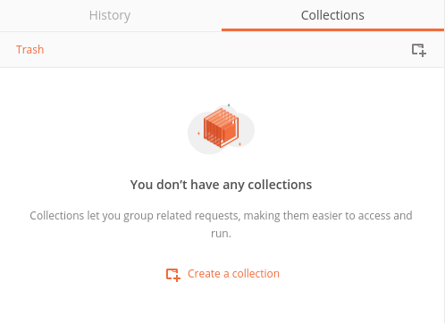
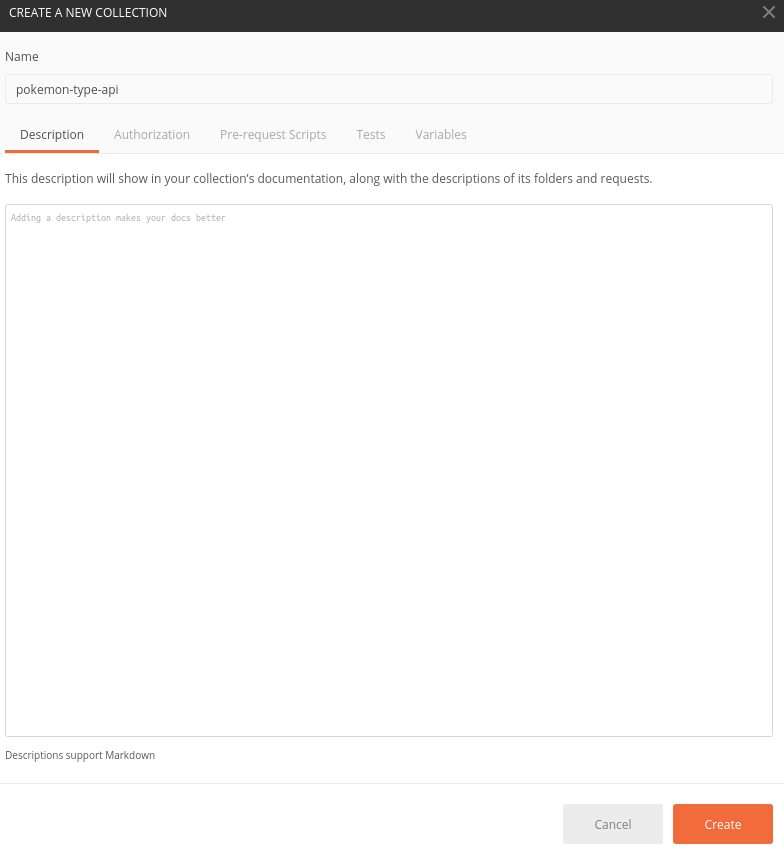
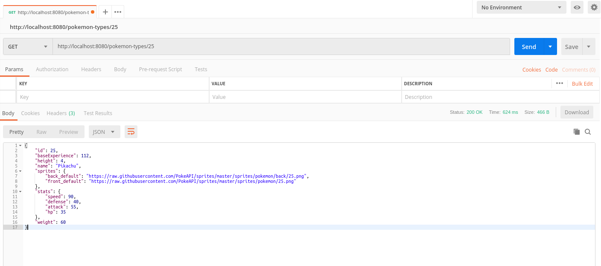

:source-highlighter: pygments
:prewrap!:

:icons: font

:toc: left
:toclevels: 4

:linkattrs:

:sectlinks:
:sectanchors:
:sectnums:

:experimental:

= ALOM - TP 6 - Interoperability

== Présentation et objectifs

Le but est de continuer le développement de notre architecture "à la microservice".

Nous allons aujourd'hui implémenter des fonctionnalités de traduction dans notre micro-service pokemon-type!

En effet, nos données de Pokemon sont aujourd'hui en anglais uniquement, ce qui peut être décourageant pour nos futurs joueurs français !

image::images/trainer-gui.png[]

Nous allons développer :

1. La gestion des traductions dans notre api pokemon-type
2. L'affichage du Pokedex traduit !

[TIP]
Nous ne repartons pas uniquement de zéro pour ce TP. Nous nous appuyons sur les TP précédents

== pokemon-type-api

=== Les données de traduction

Pour faciliter le travail, j'ai créé deux fichier JSON contenant les traductions des noms de Pokemon en français et anglais.

Ces fichiers sont disponible ici: link:translations-fr.json[translations-fr.json,window="_blank"] link:translations-en.json[translations-en.json,window="_blank"]

Déposez ces fichiers dans votre répertoire `src/main/resources`.

=== Le BO

Créez une classe `Translation`

.com.miage.alom.tp.pokemon_type_api.bo.Translation
[source,java,linenums]
----
package com.miage.alom.tp.pokemon_type_api.bo;

public record Translation(int id, String name) {}
----

=== Le repository

==== L'interface

L'interface de ce repository de traduction est simple :

.com.miage.alom.tp.pokemon_type_api.repository.TranslationRepository
[source,java,linenums]
----
package com.miage.alom.tp.pokemon_type_api.repository;

import java.util.Locale;

public interface TranslationRepository {
    String getPokemonName(int id, Locale locale);
}
----

==== Les tests unitaires

Implémentez les tests unitaires suivants :

[source,java,linenums]
.com.miage.alom.tp.pokemon_type_api.repository.TranslationRepositoryImplTest.java
----
package com.miage.alom.tp.pokemon_type_api.repository;

import org.junit.jupiter.api.Test;
import org.springframework.context.annotation.AnnotationConfigApplicationContext;

import java.util.Locale;

import static org.junit.jupiter.api.Assertions.*;

class TranslationRepositoryImplTest {

    private TranslationRepositoryImpl repository = new TranslationRepositoryImpl();

    @Test
    void getPokemonName_with1_inFrench_shouldReturnBulbizarre(){
        var name = repository.getPokemonName(1, Locale.FRENCH);
        assertEquals("Bulbizarre", name);
    }

    @Test
    void getPokemonName_with1_inEnglish_shouldReturnBulbizarre(){
        var name = repository.getPokemonName(1, Locale.ENGLISH);
        assertEquals("Bulbasaur", name);
    }

    @Test
    void applicationContext_shouldLoadPokemonRepository(){
        var context = new AnnotationConfigApplicationContext("com.miage.alom.tp.pokemon_type_api.repository");
        var repoByName = context.getBean("translationRepositoryImpl");
        var repoByClass = context.getBean(TranslationRepository.class);

        assertEquals(repoByName, repoByClass);
        assertNotNull(repoByName);
        assertNotNull(repoByClass);
    }

}
----

==== L'implémentation

Développez l'implémentation du `TranslationRepository`.

[source,java,linenums]
.com.miage.alom.tp.pokemon_type_api.repository.TranslationRepositoryImpl.java
----
package com.miage.alom.tp.pokemon_type_api.repository;

import com.fasterxml.jackson.databind.ObjectMapper;
import com.miage.alom.tp.pokemon_type_api.bo.Translation;
import org.springframework.core.io.ClassPathResource;
import org.springframework.stereotype.Repository;

import java.io.IOException;
import java.util.List;
import java.util.Locale;
import java.util.Map;

@Repository
public class TranslationRepositoryImpl implements TranslationRepository {

    record Key(Locale locale, int pokemonId){} // <3>

    private Map<Key, Translation> translations;

    private ObjectMapper objectMapper;

    public TranslationRepositoryImpl() {
        try {
            // TODO <2>
        } catch (IOException e) {
            e.printStackTrace();
        }
    }

    @Override
    public String getPokemonName(int id, Locale locale) {
        // TODO <1>
    }
}
----
<1> Implémentez la récupération du nom d'un Pokemon !
<2> Alimentez la map des traductions en chargeant les fichiers, et en récupérant leur contenu
<3> On utilise un record local à notre classe comme clé de Map !

[NOTE]
====
La récupération d'un fichier dans le classpath peut se fair en Spring avec la classe `ClassPathResource`.
Inspirez vous du `PokemonTypeRepository` pour le reste.
====

=== Le service

Maintenant que nous avons un repository capable de gérer les traductions, nous devons les utiliser.
Un bon endroit pour cela est la couche service.

Spring utilise la classe `AcceptHeaderLocaleResolver` dans sa `DispatcherServlet` pour venir alimenter un objet  `LocaleContextHolder`.
Nous pouvons donc utiliser cet objet pour récupérer la langue demandée par la requête courante !

Ajoutez les tests unitaires suivant au `PokemonTypeServiceImplTest`:

[source,java,linenums]
.PokemonTypeServiceImplTest.java
----
@Test
void pokemonNames_shouldBeTranslated_usingLocaleResolver(){
    var pokemonTypeService = new PokemonTypeServiceImpl();

    var pokemonTypeRepository = mock(PokemonTypeRepository.class);
    pokemonTypeService.setPokemonTypeRepository(pokemonTypeRepository);
    when(pokemonTypeRepository.findPokemonTypeById(25)).thenReturn(new PokemonType());

    var translationRepository = mock(TranslationRepository.class);
    pokemonTypeService.setTranslationRepository(translationRepository);
    when(translationRepository.getPokemonName(25, Locale.FRENCH)).thenReturn("Pikachu-FRENCH");

    LocaleContextHolder.setLocale(Locale.FRENCH);

    var pikachu = pokemonTypeService.getPokemonType(25);

    assertEquals("Pikachu-FRENCH", pikachu.getName());
    verify(translationRepository).getPokemonName(25, Locale.FRENCH);
}

@Test
void allPokemonNames_shouldBeTranslated_usingLocaleResolver(){
    var pokemonTypeService = new PokemonTypeServiceImpl();

    var pokemonTypeRepository = mock(PokemonTypeRepository.class);
    pokemonTypeService.setPokemonTypeRepository(pokemonTypeRepository);

    var pikachu = new PokemonType();
    pikachu.setId(25);
    var raichu = new PokemonType();
    raichu.setId(26);
    when(pokemonTypeRepository.findAllPokemonType()).thenReturn(List.of(pikachu, raichu));

    var translationRepository = mock(TranslationRepository.class);
    pokemonTypeService.setTranslationRepository(translationRepository);
    when(translationRepository.getPokemonName(25, Locale.FRENCH)).thenReturn("Pikachu-FRENCH");
    when(translationRepository.getPokemonName(26, Locale.FRENCH)).thenReturn("Raichu-FRENCH");

    LocaleContextHolder.setLocale(Locale.FRENCH);

    var pokemonTypes = pokemonTypeService.getAllPokemonTypes();

    assertEquals("Pikachu-FRENCH", pokemonTypes.get(0).getName());
    assertEquals("Raichu-FRENCH", pokemonTypes.get(1).getName());
    verify(translationRepository).getPokemonName(25, Locale.FRENCH);
    verify(translationRepository).getPokemonName(26, Locale.FRENCH);
}
----

Pour faire passer les tests unitaires, remplacez le nom du type de pokemon, après l'avoir récupéré du repository, par sa traduction.

=== Le test d'intégration

Modifiez le `PokemonTypeControllerIntegrationTest` pour ajouter un test d'intégration :

[source,java,linenums]
.PokemonTypeControllerIntegrationTest.java
----
@Test
void getPokemon_withId1_shouldReturnBulbasaur() {
    var bulbasaur = this.restTemplate.getForObject("http://localhost:" + port + "/pokemon-types/1", PokemonType.class);
    assertNotNull(bulbasaur);
    assertEquals(1, bulbasaur.getId());
    assertEquals("Bulbasaur", bulbasaur.getName()); //<1>
}

@Test
void getPokemon_withId1AndFrenchAcceptLanguage_shouldReturnBulbizarre() {
    var headers = new HttpHeaders();
    headers.setAcceptLanguageAsLocales(List.of(Locale.FRENCH)); //<2>

    var httpRequest = new HttpEntity<>(headers);

    var bulbizarreResponseEntity = this.restTemplate.exchange("http://localhost:" + port + "/pokemon-types/1", HttpMethod.GET, httpRequest, PokemonType.class);
    var bulbizarre = bulbizarreResponseEntity.getBody();

    assertNotNull(bulbizarre);
    assertEquals(1, bulbizarre.getId());
    assertEquals("Bulbizarre", bulbizarre.getName()); //<3>
}
----
<1> Cette requête sans paramètre particulier doit renvoyer la traduction par défaut (en anglais)
<2> On construit une requête en y ajoutant un header "Accept-Language"
<3> On doit bien récupérer le nom du type de Pokemon traduit !

=== Les tests avec Postman

Pour bien valider nos développements, nous pouvons également créer des tests avec Postman.

Dans Postman, créez une `Collection`

Ajoutez-y quelques requêtes. Pour ce faire, créez une nouvelle requête, et enregistrez la dans votre collection.

Utilisez l'onglet `Tests` pour y ajouter quelques tests. Cet onglet permet d'exécuter du code javascript,
permettant par exemple de valider les codes de retour HTTP ou le JSON reçu.

Créez les requêtes suivantes, avec les tests associés :

==== GET http://localhost:8080/pokemon-types/1

[source,javascript]
----
pm.test("Bulbasaur", function () {
    var bulbasaur = pm.response.json();
    pm.expect(bulbasaur.id).to.eq(1);
    pm.expect(bulbasaur.name).to.eq("Bulbasaur");
});
----

==== GET http://localhost:8080/pokemon-types/1 - Accept-Language: fr

[source,javascript]
----
pm.test("Bulbasaur", function () {
    var bulbasaur = pm.response.json();
    pm.expect(bulbasaur.id).to.eq(1);
    pm.expect(bulbasaur.name).to.eq("Bulbizarre");
});
----

==== GET http://localhost:8080/pokemon-types

[source,javascript]
----
pm.test("all pokemon types", function () {
    var jsonData = pm.response.json();
    pm.expect(jsonData.length).to.eq(151);
});

pm.test("Bulbasaur", function () {
    var jsonData = pm.response.json();
    pm.expect(jsonData[0].name).to.eq("Bulbasaur");
});

pm.test("Ivysaur", function () {
    var jsonData = pm.response.json();
    pm.expect(jsonData[1].name).to.eq("Ivysaur");
});
----

==== GET http://localhost:8080/pokemon-types - Accept-Language: fr

[source,javascript]
----
pm.test("all pokemon types", function () {
    var jsonData = pm.response.json();
    pm.expect(jsonData.length).to.eq(151);
});

pm.test("bulbizarre", function () {
    var jsonData = pm.response.json();
    pm.expect(jsonData[0].name).to.eq("Bulbizarre");
});

pm.test("Herbizarre", function () {
    var jsonData = pm.response.json();
    pm.expect(jsonData[1].name).to.eq("Herbizarre");
});
----

==== Export de la collection

Exportez votre collection Postman, dans le répertoire `src/test/resources` de votre API.
Cela vous permettra de la réutiliser plus tard et de la partager avec les autres développeurs !

=== swagger

Nous allons également exposer une interface de type `swagger` afin de faciliter nos tests et nos développements.

Cette interface nous permettra également de donner aux consommateurs de notre API un moyen facile de voir les ressources disponibles et les tester !

Pour exposer un swagger, nous allons utiliser la librairie http://springfox.github.io/springfox/[springfox, window="_blank"].

. Cette librairie analyse les `Controlleurs` Spring, pour générer de la documentation au format swagger.

[TIP]
Cette librairie ne fait pas partie de Spring. Spring propose la génération de documentation à travers leur module https://spring.io/projects/spring-restdocs[spring rest-docs,window="_blank"]

Ajoutez la dépendance suivante à votre `pom.xml` :

[source,xml]
.pom.xml
----
<dependency>
    <groupId>io.springfox</groupId>
    <artifactId>springfox-boot-starter</artifactId>
    <version>3.0.0</version>
</dependency>
----

Votre IHM swagger sera disponible à l'url http://localhost:8080/swagger-ui/index.html[, window="_blank"], tandis que le JSON
sera disponible à l'url http://localhost:8080/v2/api-docs[, window="_blank"].

Si vous voulez en personnaliser des éléments, allez lire la http://springfox.github.io/springfox/docs/current/[documentation de springfox, window="_blank"] !

== game-ui

Modifiez votre micro-service `game-ui` pour y intégrer la gestion de la locale!

Vous pouvez par exemple, récupérer la locale avec la méthode `LocaleContextHolder.getLocale()` de Spring directement
dans le PokemonTypeServiceImpl du `game-ui`, et la transmettre en utilisant le RestTemplate.
De cette manière, la langue utilisée lors des échanges sera celle du navigateur de l'utilisateur !

== trainer-api

Implémentez sur l'API trainer :

. l'exposition d'un swagger
. une collection Postman permettant de
  * récupérer la liste des dresseurs de Pokemon
  * récupérer un dresseur de Pokemon
  * créer un dresseur de Pokemon
