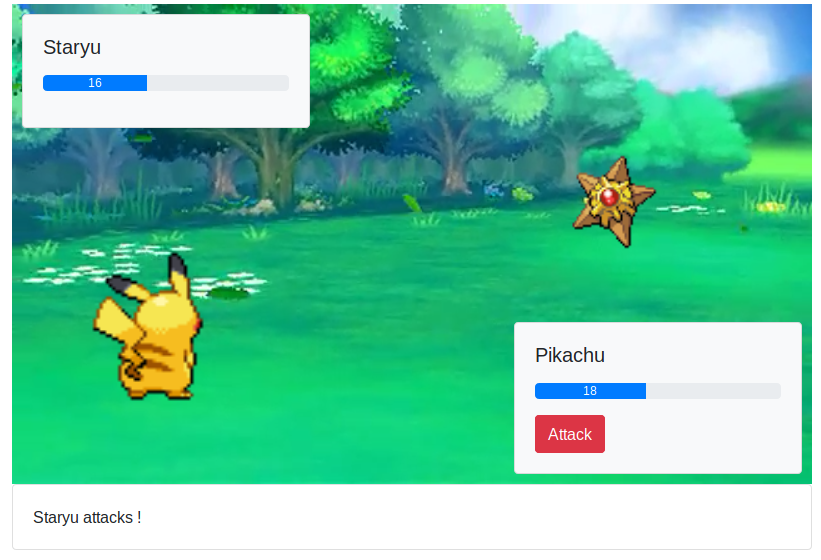
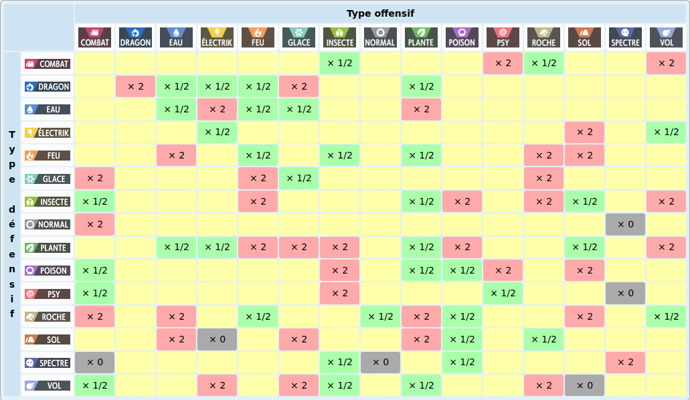

:source-highlighter: pygments
:prewrap!:

:icons: font

:toc: left
:toclevels: 4

:linkattrs:

:sectlinks:
:sectanchors:
:sectnums:

:experimental:

:stem:

= ALOM - TP 10 - Practice even more !

== Présentation et objectifs

Le but est de continuer le développement de notre architecture "à la microservice".

Nous allons :

* continuer (ou commencer) le développpement de notre micro-service de combat !
* développer un micro-service de boutique

.Notre architecture !
image::images/battle-architecture.png[]

== `game-ui`

=== Ecran de combat !

NOTE: Cette partie nécessite d'avoir un projet `battle-api` complètement fonctionnel.

Pour vous faciliter le travail, j'ai développé pour vous un écran simple de combat, ainsi qu'un javascript (vanilla), qui
requête en AJAX l'api `/battles` et permet de jouer un combat !

.Un combat en cours !

Le JS est disponible ici : link:battle.js[battle.js,window="_blank"].

L'image de fond est disponible ici : link:images/battle_background.png[battle_background.png,window="_blank"].

L'écran de jeu est défini en template mustache via le code suivant :

[source,xml]
.fight.html
----
<!doctype html>
<html lang="en">
<head>
    <!-- Required meta tags -->
    <meta charset="utf-8">
    <meta name="viewport" content="width=device-width, initial-scale=1, shrink-to-fit=no">
    <title>Pokemon Manager</title>

    <link rel="stylesheet" href="https://stackpath.bootstrapcdn.com/bootstrap/4.4.1/css/bootstrap.min.css" integrity="sha384-Vkoo8x4CGsO3+Hhxv8T/Q5PaXtkKtu6ug5TOeNV6gBiFeWPGFN9MuhOf23Q9Ifjh" crossorigin="anonymous">
    <link rel="stylesheet" href="https://cdnjs.cloudflare.com/ajax/libs/animate.css/3.7.2/animate.min.css">
</head>

<body>

    <h1 class="pt-md-5 pb-md-5">Arena </h1>

    <h2>{{trainerName}} Vs {{opponentName}}</h2>

    

        
        

        

            

                <h5 class="card-title" id="{{trainerName}}-pokemon-name"></h5>
                

                    

                        

                    

                

                <button class="btn btn-danger" id="attack-btn" onclick="playerCommand('ATTACK');">Attack</button>
            

        

        

            

                <h5 class="card-title" id="{{opponentName}}-pokemon-name"></h5>
                

                    

                        

                    

                

            

        

    

    

    

</body>
</html>
----

Le template a besoin de 2 variables : `trainerName` et `opponentName`.

Le fichier `battle.js` doit être déposé dans `src/main/resources/static/scripts`.
L'image de fond doit être déposée dans `src/main/resources/static/images`.

Le combat utilise `Bootstrap`, `JQuery` et `Animate.css`.

==== Le controlleur

Le controlleur servant cet écran peut être codé de cette manière :

[source,java,linenums]
.BattleController.java
----
@GetMapping("/fight/{opponent}")
public ModelAndView fight(Principal principal, @PathVariable String opponent){
    var modelAndView = new ModelAndView("fight");

    modelAndView.addObject("trainerName", principal.getName());
    modelAndView.addObject("opponentName", opponent);

    return modelAndView;
}
----

De cette manière, on peut déclencher un combat en se rendant sur l'URL http://localhost:9000/fight/Misty[,window="_blank"]

=== Cross Origin sur Battle-API

Le script `battle.js` appelle l'API battle. Cette API est appelée en `Cross-Origin`.
Du point de vue du navigateur web (firefox/chrome), l'origine est composée :

* du scheme (ex: http/https)
* de l'hôte (ex: localhost)
* du port (ex: 9000/8080...)

Lorsqu'une requête est émise vers une autre origine que celle de la page affichée, le navigateur
exécute tout d'abord une requête `HEAD`, pour demander au serveur s'il accepte d'être appelé
depuis une autre origine que lui-même. C'est une mécanique de sécurité permettant d'éviter
les appels indésirables sur une API.

Nous devons donc activer le support du `Cross-Origin` sur notre API battle, pour qu'elle
accepte les requêtes provenant du navigateur web.

NOTE: Nous n'avons à gérer le `Cross-Origin` uniquement quand c'est un navigateur qui est la source d'une requête.
Pas besoin de `Cross-Origin` pour les appels entre APIs.

==== Configuration

La configuration du `Cross-Origin` en Spring se fait en ajoutant l'annotation `@CrossOrigin` sur les controlleurs ou méthodes
à autoriser.
Ajoutez cette annotation sur le controlleur de votre `battle-api`.

== Gain d'XP

Avec l'arrivée des combats, on constate que les statistiques de nos chers Pokemon sont importantes.
Les combats successifs mettent les Pokemon et leurs dresseurs à rude épreuve.

Ajoutez la statistique "experience" aux Pokemon, dans l'API Trainer.
La statistique "level" devient une propriété calculée.

Le niveau du Pokemon "level" est la racine cubique du nombre de points d'expérience (arrondi à l'inférieur).
À l'inverse, un pokemon d'un certain niveau possède en points d'expérience la valeur du niveau au cube.

Par exemple, Ondine (Misty), possède un Stari et un Staross, de niveaux 18 et 21.
Stari a donc 18³ points d'expérience, soit 5832.
Staross a 21³ points d'xp, soit 9261.

Avec 6245 points d'expérience, Pikachu est au niveau 18 également. Pour passer au niveau 19, il lui faudra 19³-6245 points d'XP supplémentaire.

Les niveaux des Pokemon sont limités à 100 pour un nombre d'XP maximum de 1 000 000.

Le gain d'expérience lors d'un combat est régi par la formule suivante :

`1.5*(baseExperience)*(level pokemon vaincu)`

Quand Pikachu met KO le Stari d'Ondine, il gagne `1.5 * 112 * 18 = 3024` points d'expérience

L'expérience des Pokemon grandi à chaque combat, et leur niveau avec.

Dans l'API Battle, lorsqu'un Pokemon en met KO un autre, modifiez l'expérience du Pokemon qui a gagné avec ces formules,
et sauvegardez la nouvelle information dans l'API Trainer (via un PUT HTTP)

== Multiplicateurs de type

Lorsqu'un Pokemon en attaque un autre, les dégâts infligés dépendent également du type de pokemon attaquant / défenseur.

Voici le tableau de multiplicateur de dégâts en fonction des types attaquants / défenseurs :

Appliquez les modificateurs de type dans votre `battle-api` !

== La boutique

Les dresseurs de Pokemon ont un portefeuille virtuel composé de Poké-Dollar 💰.

Ils peuvent créditer leur portefeuille en achetant des Poké-Dollar, au taux de change d'1 euro pour 20 000 💰.
Chaque dresseur démarre avec la somme de 10 000 💰 offerts.
Un dresseur qui se crée un compte, peut aussi également choisir un Pokemon offert parmi les 3 starters (id 1, 4, 7).

Une boutique leur permet :

* d'acheter des Pokeballs contenant des Pokemon aléatoires !
* d'acheter des bonbons pour augmenter le niveau d'un Pokemon !

Voici quelques objets disponibles dans la boutique:

|===
| Super Bonbon | Augmente le niveau d'un Pokemon ! | 5 000 💰
| Pokeball | Contient un Pokemon aléatoire commun de niveau 5 | 10 000 💰
| SuperBall | Contient un Pokemon aléatoire non-commun de niveau 10 | 25 000 💰
| HyperBall | Contient un Pokemon aléatoire rare de niveau 20 | 50 000 💰
| MasterBall | Contient un Pokemon aléatoire légendaire (un seul achat max par dresseur) de niveau 40 | 100 000 💰
|===

L'achat d'une PokeBall, SuperBall, HyperBall ou MasterBall a pour effet d'ajouter le Pokemon à la liste des Pokemon du dresseur.

.Ids de rareté des Pokémon (probabilités égales pour chaque id)
|===
| Pokemons communs | 10 13 16 19 41 133 48 43 129 96 52 21 69 46 98 116
| Pokemons non-communs | 35 32 29 23 104 118 60 90 39 81 92 102 79 54 124 120 72 132
| Pokemons rares | 147 58 74 95 77 37 109 27 126 63 25 125 66 88 111 100 108 123 127 114 138 140
| Pokemons légendaires | 144 145 146 150 151
|===

Le lien pour créer le squelette de votre projet sur Github est le suivant : https://classroom.github.com/a/kLAwvePr

La boutique doit :

* gérer le portefeuille de chaque dresseur, et lui permettre de l'approvisionner via une API REST
* exposer une API REST consommable par le `game-ui` pour afficher la liste des produits
* mettre à jour l'équipe du dresseur lors d'un achat (avec un PUT REST)
